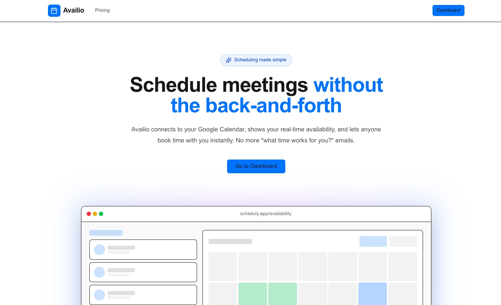
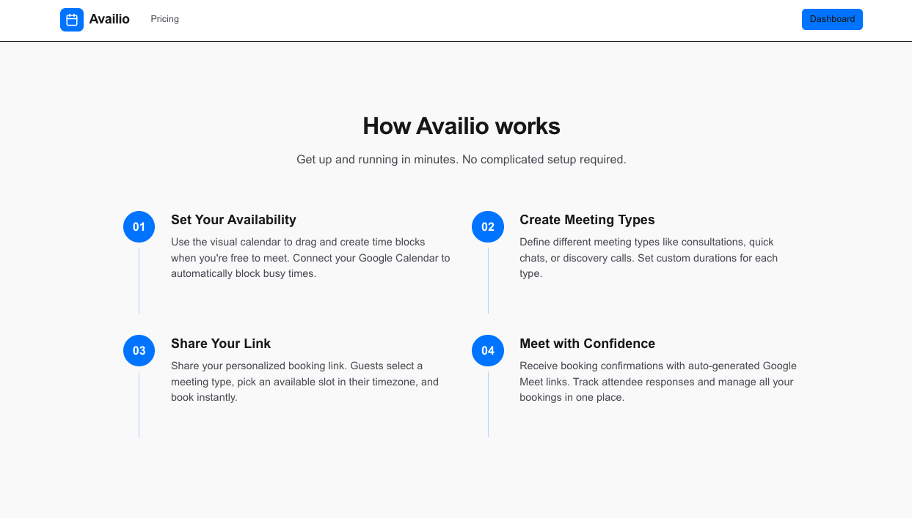
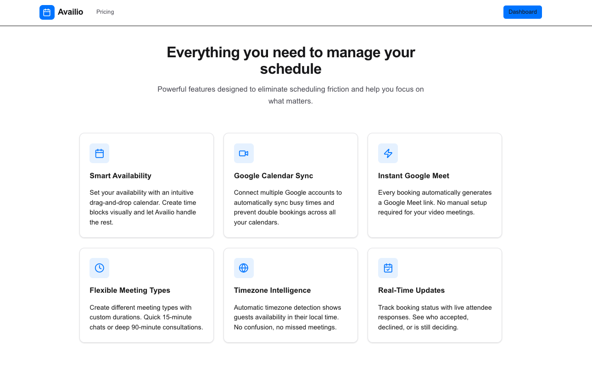
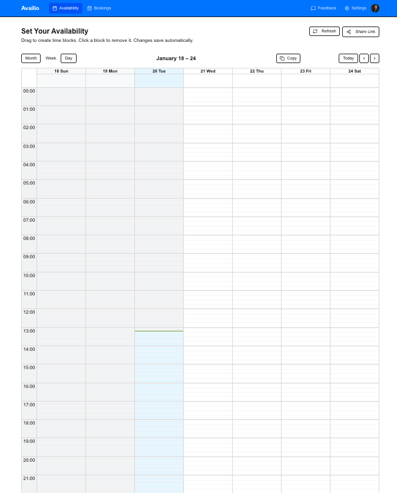
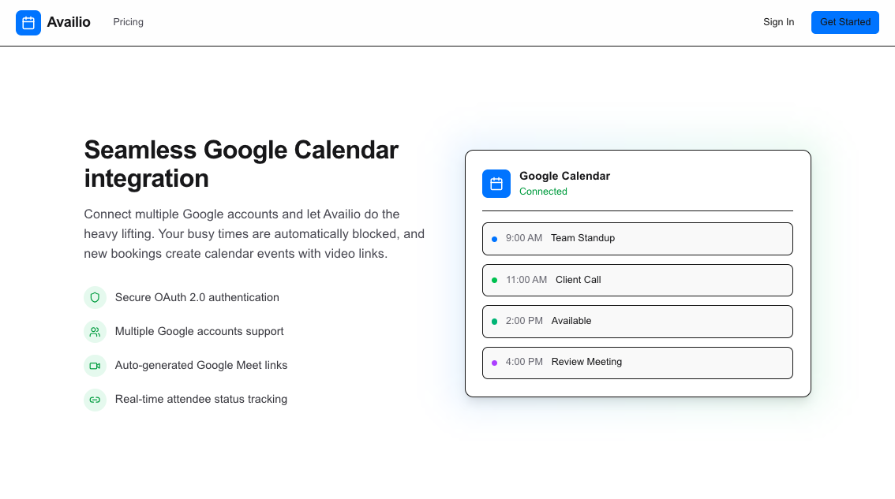

# 📅 Availio — Modern Scheduling SaaS

<p align="center">
  <a href="https://nextjs.org"></a>
  <a href="https://www.typescriptlang.org"></a>
  <a href="https://clerk.com"></a>
  <a href="https://developers.google.com/calendar"></a>
  <a href="https://www.sanity.io"></a>
  <a href="https://tailwindcss.com"></a>
  <a href="https://ui.shadcn.com"></a>
  <a href="https://vercel.com"></a>
</p>

---

## 🚀 Overview

**Availio** is a full-stack scheduling SaaS that eliminates calendar back-and-forth by providing real-time availability, automated Google Calendar syncing, and a beautiful booking experience — all powered by modern web architecture.

Designed as a **Calendly-class product**, Availio supports subscription tiers, multi-calendar sync, timezone intelligence, and public booking pages.

---

## ✨ Key Features

### 🗓 Smart Scheduling
- Visual **drag-and-drop availability management**
- React Big Calendar for intuitive scheduling
- Custom meeting types with flexible durations

### 🔄 Google Calendar Integration
- Secure OAuth 2.0 authentication
- Multi-calendar sync to prevent double bookings
- Automatic Google Meet link generation
- Token refresh handling for expired credentials

### 🌍 Timezone Intelligence
- Automatic timezone detection
- Guests book in their local time
- No missed meetings, no confusion

### 🔗 Public Booking Pages
- Shareable booking links  
  `/book/{username}/{meeting-type}`
- Real-time availability validation
- Attendee status tracking (accepted / declined / pending)

### 💳 Subscriptions & Billing
- Clerk-powered billing (Free / Starter / Pro)
- Plan-based feature limits:
  - Connected calendars
  - Monthly booking caps
- Feature gating enforced at server level

### 📊 Admin Dashboard
- Booking analytics & insights
- User feedback management
- Subscription overview

### 🧠 Robust Data Design
- Lazy deletion for cancelled bookings
- Google Calendar as source of truth
- Type-safe queries via Sanity TypeGen

---

## 🖼️ Screenshots

### 🏠 Landing & How It Works

| Home | How It Works |
|-----|--------------|
|  |  |

### 📊 Dashboard & Features

| Feature Overview | User Dashboard |
|------------------|----------------|
|  |  |

### 📅 Availability & Calendar

| Availability Calendar | Calendar Sync |
|-----------------------|---------------|
|  |  |

### ⚙️ Settings & Integrations

| Settings | Google Calendar Integration |
|----------|-----------------------------|
|  |  |

---

## 🧱 Tech Stack

| Category | Technology |
|-------|------------|
| Framework | **Next.js (App Router)** |
| Language | **TypeScript (strict)** |
| Auth & Billing | **Clerk** |
| CMS | **Sanity (Embedded Studio)** |
| Calendar | **Google Calendar API** |
| UI | **Tailwind CSS v4 + shadcn/ui** |
| Scheduling UI | **React Big Calendar** |
| Tooling | **Biome (lint + format)** |
| Deployment | **Vercel** |

---

## 🧭 How It Works

1. **Set Availability**  
   Drag to create time blocks. Busy times auto-sync from Google Calendar.

2. **Create Meeting Types**  
   Define custom durations and booking rules.

3. **Share Booking Link**  
   Guests select a time in their timezone.

4. **Meet with Confidence**  
   Google Meet links auto-generated, confirmations synced instantly.

---

## ⚙️ Architecture Highlights

- Server Actions for secure mutations
- OAuth token refresh handled transparently
- Subscription limits enforced server-side
- Type safety from database → UI
- Clean separation of client & server components

---

## 🛠 Local Development

### Prerequisites
- Node.js 18+
- Google Cloud project with Calendar API enabled
- Clerk account
- Sanity project

### Install
```bash
git clone https://github.com/johnsonr84/scheduling-app-saas.git
cd scheduling-app-saas
npm install
```

### Environment Variables
Create `.env.local`:

```env
# Clerk
NEXT_PUBLIC_CLERK_PUBLISHABLE_KEY=
CLERK_SECRET_KEY=

# Google Calendar
GOOGLE_CLIENT_ID=
GOOGLE_CLIENT_SECRET=
GOOGLE_REDIRECT_URI=

# Sanity
NEXT_PUBLIC_SANITY_PROJECT_ID=
NEXT_PUBLIC_SANITY_DATASET=
SANITY_API_TOKEN=

# App
NEXT_PUBLIC_APP_URL=http://localhost:3000
```

### Run
```bash
npm run dev
```

---


## 📈 Why This Project Matters

Availio demonstrates **production-grade SaaS engineering**:
- OAuth edge-case handling
- Subscription-driven architecture
- Real-time scheduling complexity
- Clean UX with scalable backend design

Built to reflect real-world product standards.

---

## 📄 License

MIT License — free to use, modify, and learn from.

---
## 👨‍💻 Author

**Robert Johnson**  
Full-Stack & AI Engineer  
GitHub: https://github.com/johnsonr84

**Built with precision by Rob Johnson**  
_Engineering modern SaaS products with real-world complexity._
